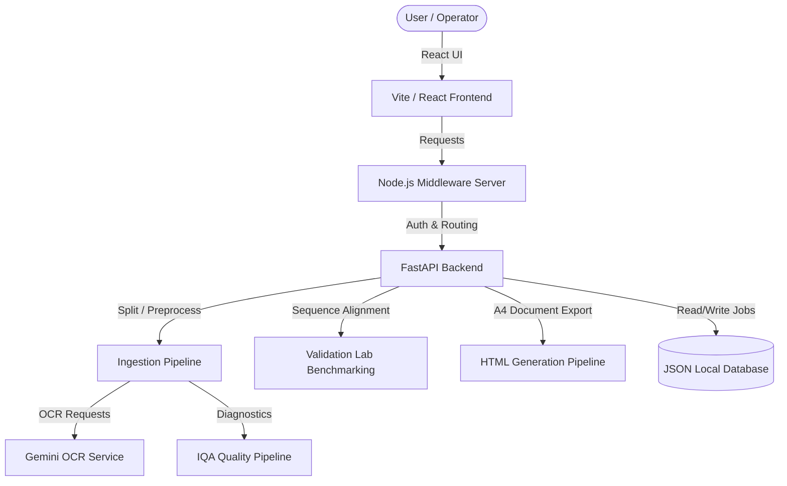

# TITUS Project 082

A production-grade, AI-powered document intelligence and Optical Character Recognition (OCR) platform designed for handwritten examination papers. The platform automates the extraction, structuring, and manual verification of examination documents, providing a high-fidelity editor with real-time feedback and benchmarking accuracy against ground truth documents.

---

## Features

- **Ingestion & Processing Ingestion Pipeline:** Splits incoming multi-page PDFs or batch images into ordered page representations, applies brightness/contrast filters, and streams status dynamically using Server-Sent Events (SSE).
- **OCR Parsing Pipeline:** Powered by Gemini OCR models, transforming handwritten scanned elements into structured examination markdown.
- **Image Quality Assessment (IQA) Pipeline:** Redesigned to perform independent checks for Resolution, Blur, Contrast, Brightness, Exposure, Noise, Perspective distortion, Skew, and Shadows to classify documents correctly instead of generic DPI flags.
- **Manual Review Workspace:** Re-engineered inline editing using a bidirectional `contentEditable` high-fidelity sheet panel. Bounding boxes on the original scanned page synchronize on-click with the text cursor positions.
- **Confidence Highlighting:** Identifies low-confidence segments and renders them highlighted with dotted underlines and tooltips without displaying raw HTML.
- **Validation Lab:** Evaluates OCR accuracy (Character Error Rate, Word Error Rate, and overall matching percentage) using industry-standard sequence alignment algorithms, preventing offset drift and ignoring ground truth metadata header pages.
- **HTML Document Generation Pipeline:** Compiles verified examination questions and options into standalone, offline-ready A4 HTML sheets, embedding all CSS and print styles with zero truncation.
- **Authentication:** Standard authentication portals tailored for Operators, Document Managers, and Administrators.
- **Dashboard:** Unified dashboard to upload documents, trace processing progress, and view performance logs.

---

## Architecture



---

## Tech Stack

### Frontend
- **Framework:** React 19, TypeScript
- **Bundler:** Vite 8.1
- **Icons:** Lucide-React
- **Styling:** CSS Modules, TailwindCSS Variable tokens, responsive flexbox grid layouts

### Backend
- **Framework:** Python, FastAPI, Uvicorn
- **Utilities:** PyPDF2, PDF2Image, OpenCV (for image processing), Pydantic

### OCR Models
- **Engine:** Google Gemini Pro / Gemini Flash 2.5 API

### Database
- **Storage:** Local persistent JSON database for jobs, metadata, and audit logs.

### Frameworks & Tools
- **Runtime:** Node.js, Python 3.10+
- **Execution:** Uvicorn (FastAPI) and Express/TS-Node (Middleware)

---

## Installation

### 1. Clone the Repository
```bash
git clone https://github.com/balijepallishashank/TITUS-Document-Intelligence.git
cd PROJECT-082
```

### 2. Configure Environment Variables
Create a `.env` file in the root directory:
```env
GEMINI_API_KEY=your_gemini_api_key_here
GOOGLE_API_KEY=your_google_api_key_here
PORT=5173
BACKEND_PORT=8000
MIDDLEWARE_PORT=3000
```

### 3. Run Backend (Python FastAPI)
```bash
# Navigate to the workspace root, activate virtualenv if needed
pip install -r requirements.txt
python -m uvicorn app.main:app --reload --host 127.0.0.1 --port 8000
```

### 4. Run Frontend (React Vite & Node Middleware)
```bash
# Install dependencies for both root middleware and frontend
npm install
cd TITUS-Document-Intelligence
npm install
npm run dev
```

---

## Project Structure

```text
PROJECT-082/
├── .gitignore               # Main ignore rules for node_modules, cache, environment files
├── package.json             # Root Node server configurations and dependencies
├── requirements.txt         # Backend Python packages (FastAPI, OpenCV, etc.)
├── tsconfig.json            # Root TypeScript compiler rules
├── app/                     # Python Backend application
│   ├── main.py              # Main API routes registration and server setup
│   ├── api/                 # Endpoint logic (upload, jobs, metrics, auth)
│   ├── core/                # Ingestion, PDF processing, and HTML document generators
│   └── ocr/                 # Gemini integrations, prompt setups, and structured parsers
├── src/                     # Node.js Middleware source files
│   └── server.ts            # Node.js orchestration entrypoint
├── tests/                   # Backend unit tests
└── TITUS-Document-Intelligence/ # React Frontend application
    ├── src/
    │   ├── components/      # Common UI components (buttons, cards, layout structures)
    │   ├── pages/           # Platform views (Review workspace, Validation Lab, Dashboard)
    │   └── App.tsx          # Frontend routes configuration
    └── package.json         # Frontend Node dependencies (React, Vite, Lucide)
```

---

## OCR Ingestion & Processing Pipeline

1. **Upload:** Operator posts a document (PDF or batch of images) to `POST /api/v1/upload`.
2. **Segmentation:** PDF2Image converts PDF pages to high-resolution PNG copies.
3. **Quality Check (IQA):** The image page passes through the image quality pipeline to evaluate contrast levels, brightness, noise frequencies, and skew. Diagnostic warnings are compiled into `quality_report`.
4. **OCR Dispatch:** Structured Gemini API prompt executes on each page to construct markdown text containing elements, questions, and option choices.
5. **JSON Parsing:** The Markdown parser maps text blocks into structural Node trees (`section`, `question`, `table`, `marks`, etc.) and stores them in the JSON database.

---

## Validation Lab & Benchmarking

The Validation Lab provides a benchmarking engine to measure the accuracy of parsed documents:
- **Ground Truth Ingestion:** Operators upload OCR output alongside the verified ground truth document.
- **Drift Prevention:** Employs standard sequence alignment (Levenshtein edit-distance metric) line-by-line instead of unified file-level comparisons. This ensures that any omitted header pages or metadata formatting do not shift subsequent calculations.
- **Analytics:** Reports Character Error Rate (CER), Word Error Rate (WER), character accuracy percentages, and details visual text differences in a highlight-diff panel.

---

## HTML Generation

During Manual Review completion, the editor compiles page representations to print-ready HTML:
- **A4 Print Layout:** Embeds global print stylesheets targeting standard portrait dimensions with page-break-after structures.
- **Offline Self-Containment:** All required styles and highlights are fully inline/embedded inside the exported `.html` file, allowing it to open immediately in standard browsers offline.
- **Deduplication:** Strips duplicate prefixes from question lists during generation.

---

## Screenshots

*(Placeholders for future interface screenshots)*
- **Dashboard:** `[Placeholder: dashboard_view]`
- **Manual Review Editor:** `[Placeholder: review_workspace_view]`
- **Validation Lab Benchmarks:** `[Placeholder: validation_lab_view]`

---

## Roadmap

- Add asynchronous processing workers using Celery and Redis.
- Integrate cloud-based S3/GCS storage boundaries.
- Support advanced model fine-tuning feedback loops.

---

## Contributors


* **Internship:** TITUS Solutions

---

## License

This project is licensed under the MIT License - see the LICENSE placeholder for details.
